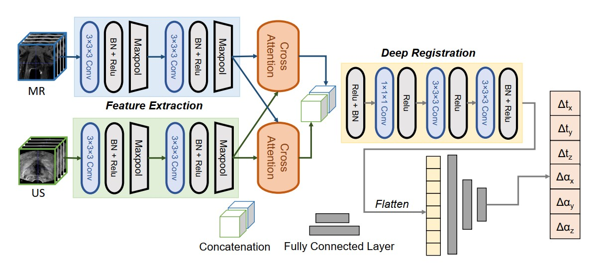

# Attention-Reg 

This repository is an implementation of **"Cross-modal Attention for MRI and Ultrasound Volume Registration"** accepted by MICCAI 2021. 
--------------------------------------------------------------------------------

- We have prepared 9 dummy samples for demo, which can be viewed by running "python view_sample.py". Samples are stored in the `sample` folder. Six samples are for training, two for validation, and one for testing.

- In practice, we initialize new transformations and resample for network input every epoch. For the purpose of demonstration, the dummy samples are the resampled result of random initialzations. 

- To train a model, run `"python train_network.py"`. To test your model, add the model name in `test_network.py` and run `python test_network.py`.

Our network is implemented through PyTorch 1.6.0, and the code for the network can be found at `"networks/generator.py"`.